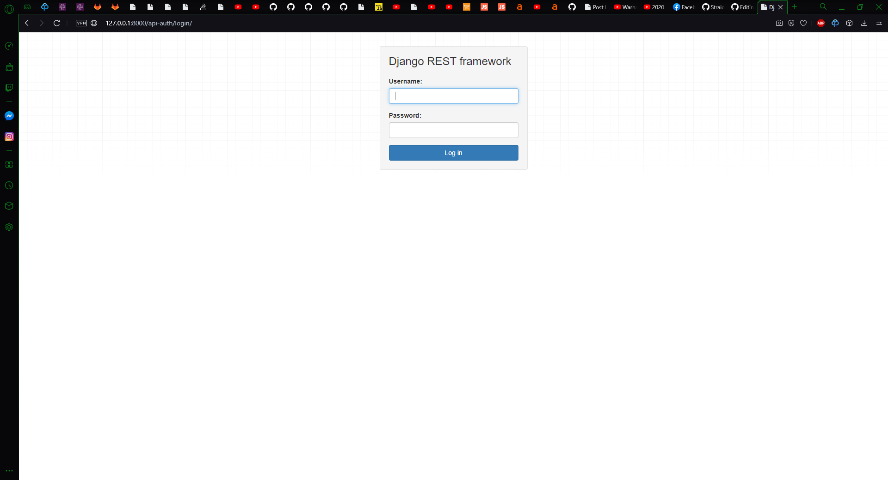
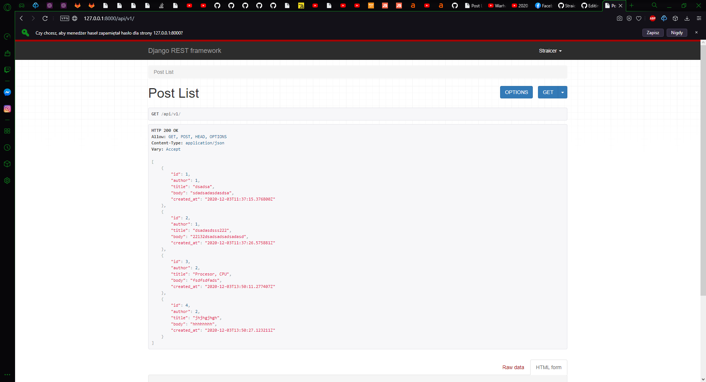
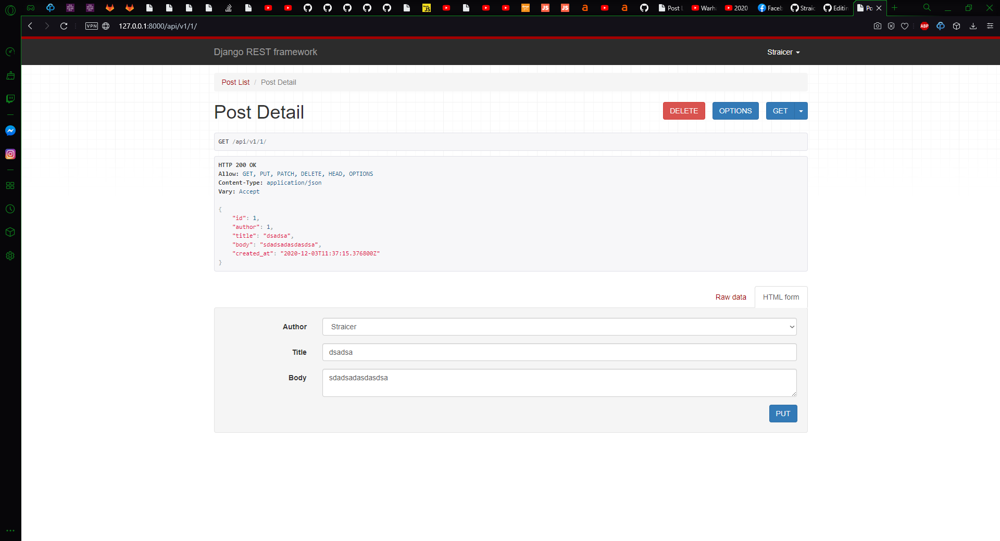
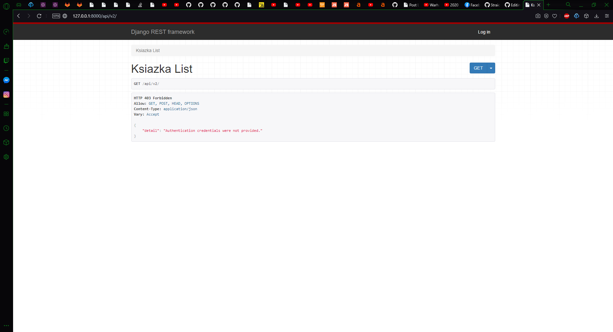
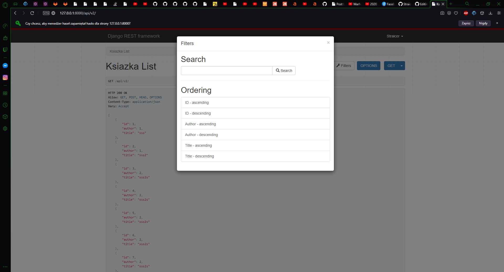
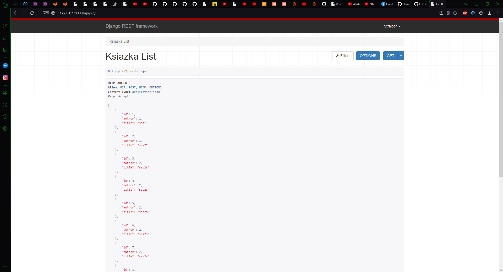
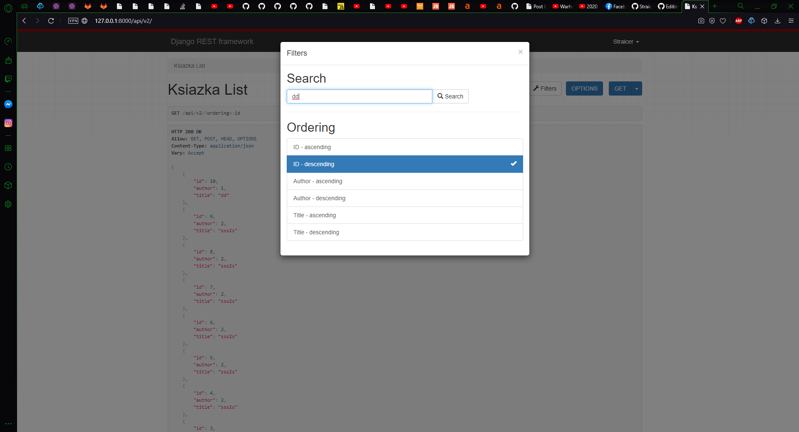
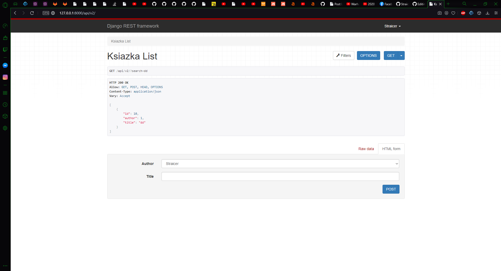
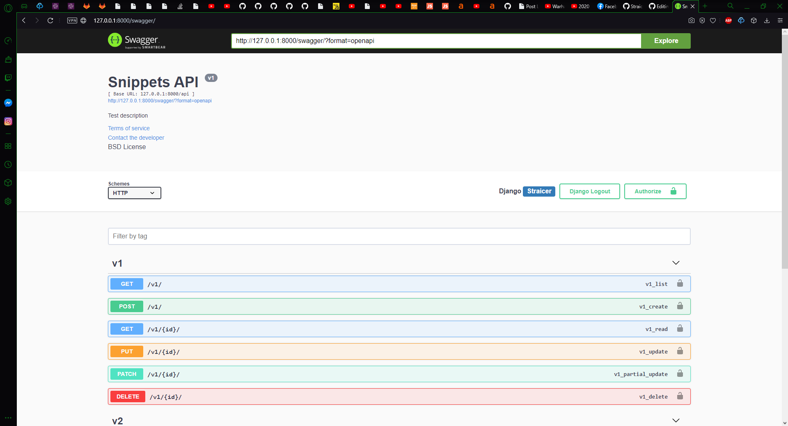
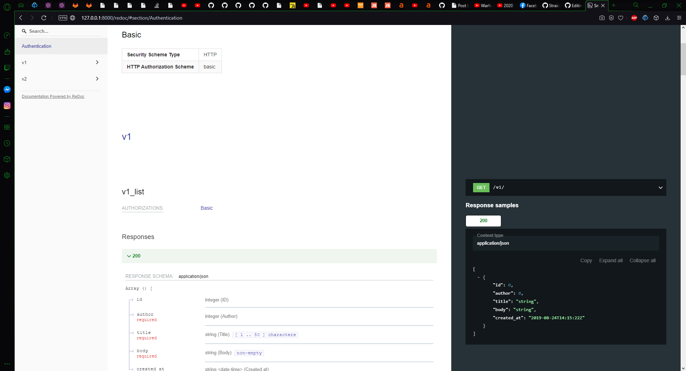

# Linki przekierowujące do Labolatoriów 

<a href="#Lab4">Labolatorium nr: 1</a>

<a href="#Lab5">Labolatorium nr: 2</a>

<a href="#Lab6">Labolatorium nr: 3</a>

# Laboratorium 4 REST API z DRF

# Laboratorium 5 

# Laboratorium 6 

