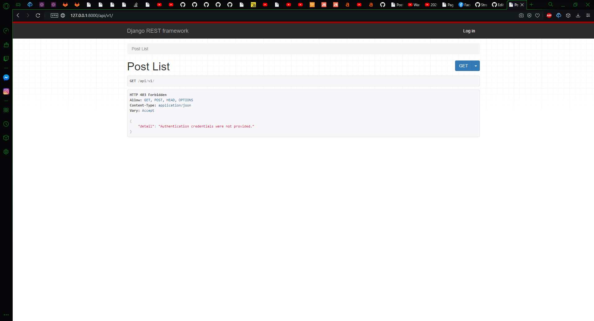

# Laboratorium 4 REST API z DRF

<a href = "https://github.com/wsvincent/restapiswithdjango">Repozytorium poglądowe </a>

 
DRF jest naprawdę przyjemny po lekkim zgłębieniu . W miare przejrzysta dokumentacja , Redoc-Dokumentacja Moich API , bardzo mało kodu w porównaniu do czystego diango 

<h1>DRF api\v1</h1>

Post list dla nie zalogowanych . W kórym nie wyświetlają się żadne posty ponieważ zostasły ustawione opcje dostępu DEFAULT_PERMISSION_CLASSES ('rest_framework.permissions.IsAuthenticated') 

Logowanie 

Post list po zalogowaniu 

Post detail 

Jakie kolwiek akcje na poście może tylko wykonywać autor .

<h1>DRF api\v2</h1>
Model Ksiazka z danymi (author  title created_at updated_at) i serializer z fields = ('id', 'author', 'title',)
 
Filty : (filter_backends = [filters.SearchFilter ,filters.OrderingFilter])
 
Lista Ksiazek 

Lista Ksiazek bez zalogowania 

Wyszukiwanie i filtry 

Filtr Id ASC

Filtr Id DESC

Przed wyszukiwaniem 

Wyszukane posty 

<h1>Swagger</h1>
Jak widać są tu dwie aplikacje v1 i v2 .

<h1>Redoc (Dokumentacja Moich API)</h1>

