# Laboratorium 6 REST API z DRF (Kontynuacja)

<a href = "https://github.com/wsvincent/restapiswithdjango">Repozytorium poglądowe </a>

 
Kontynuacja Lab 4.Dodałem viewsety, routery, uwierzytelnianie oraz licznik wizyt z użyciem cookies w podstronie /test_cookie/. Wymagane było korzystanie z dokumentacji przy większych zmiannach .
 
Zmiany api.
 
Dodałem widok dla logawania i wylogowania , resetu hasła i potwierdzenia resetu oraz widok rejestracji przy urzyciu pakietu Django-rest-auth .

<h1>DRF api\v1</h1>
<h1>Logoin</h1>

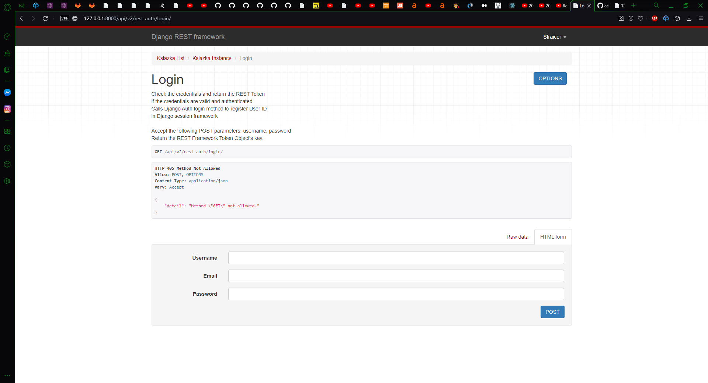
<h1>Logout</h1>

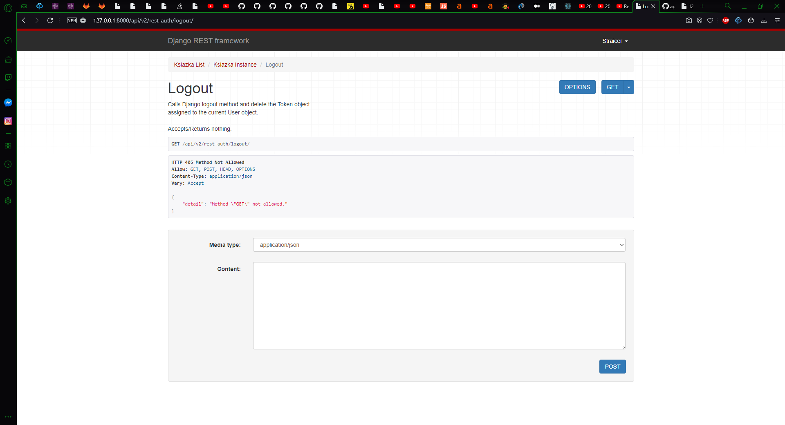
<h1>Password Reset</h1>

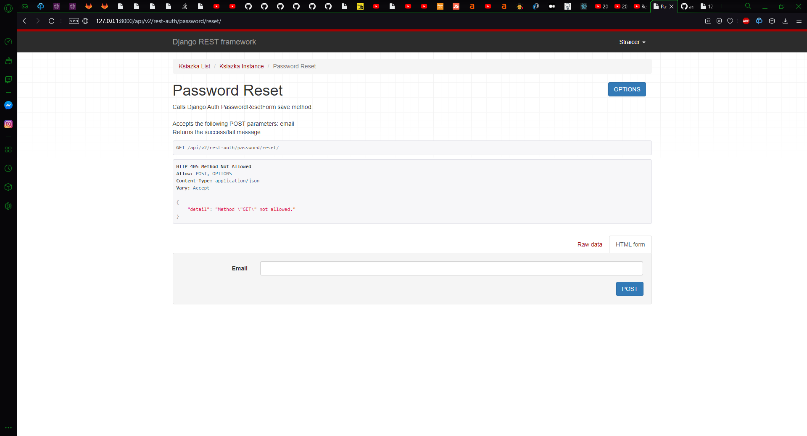
<h1>Password Reset confirm</h1>

<h1>Register</h1>

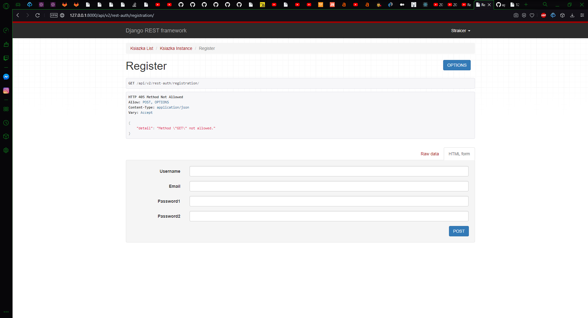
<h1>Uwierzytelnienie Tocken</h1>

Na poniższym screanie uruchamiam uwierzytelnianie za pomocą tokena. Aby teraz móc się zalogować potrzebny jest tocken przypisany do konta . 

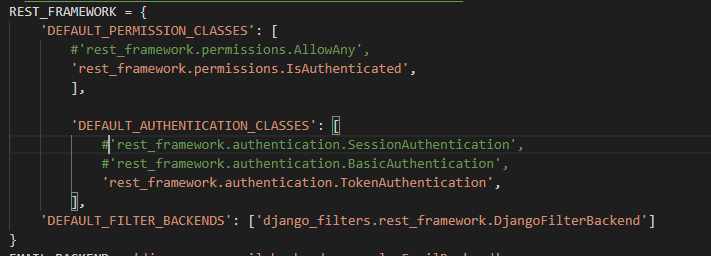
<h1>Tockeny</h1>

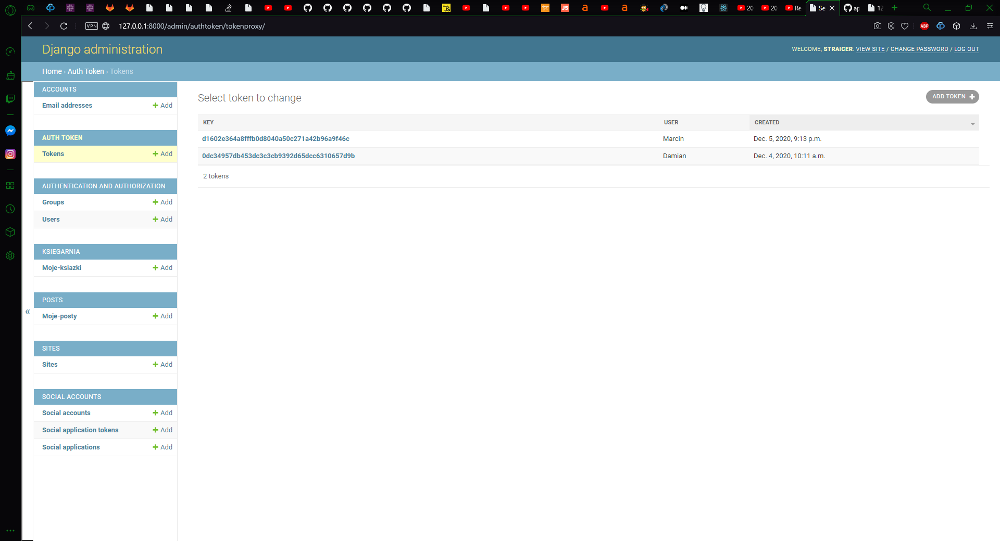
<h1>Zalogowanie się przy pomocy tokena</h1>

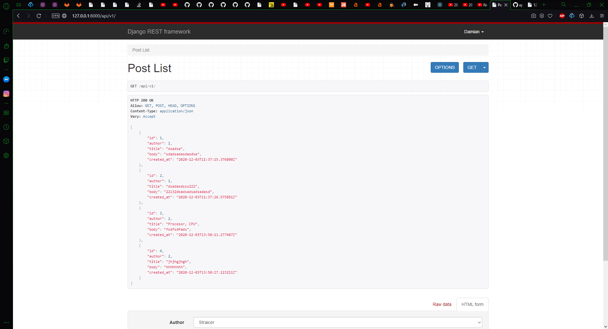

<h1>Tworzenie nowego użytkonika </h1>

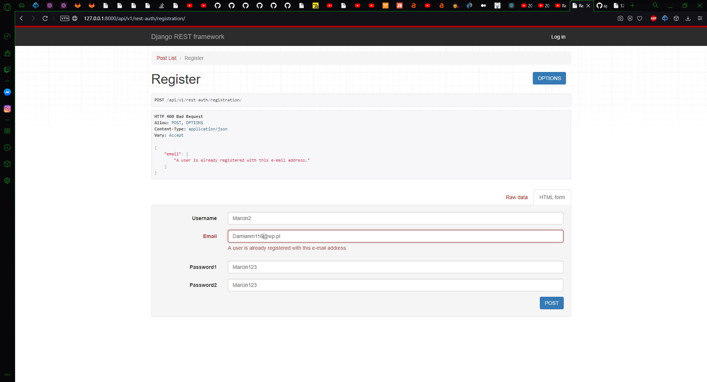
<h1>Zarejestrowanie i otrzymanie tockena urzytkownika </h1>

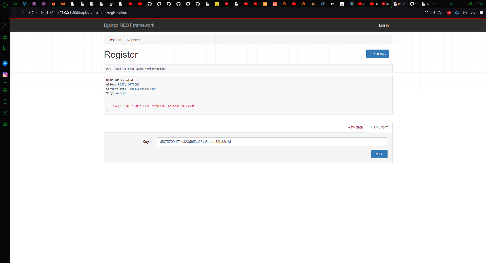

<h1>Uwierzytelnienia</h1>
DRF posiada 2 domyślne metody uwierzytelniania :SessionAuthentication i BasicAuthentication .  W poniższym screanie wybieram SessionAuthentication i TockenAuthentication dzięki czemu urzytkownik bez tokenu może się zalogować .

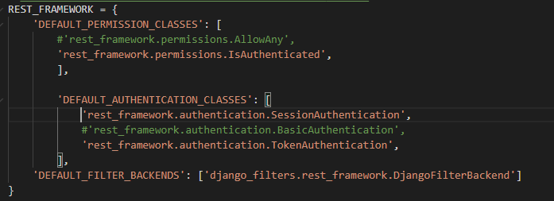

Stworzyłem również dla api v1 a dokładnie dla url "api/v1/test_cookie" bardzo prosty licznik wejść. Stworzyłem nową metodę oraz podpiąłem ją pod odpowiedni url . Metoda ta zlicza ilość wejść na podstronę dzięki request.COOKIE.get , po wiejściu na podstronę po raz pierwszy cookie zawiera text "Welcome for the first time" oraz visits = 1, po kolejnych wejściach coockie zawiera text "Welcome back" oraz liczbę wejść visits .   

<h1>Metoda</h1>

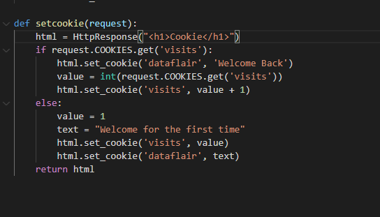
<h1>Url</h1>

<h1>Cookie. Pierwsze wejście.</h1>

<h1>Cookie. Kolejne wejście.</h1>

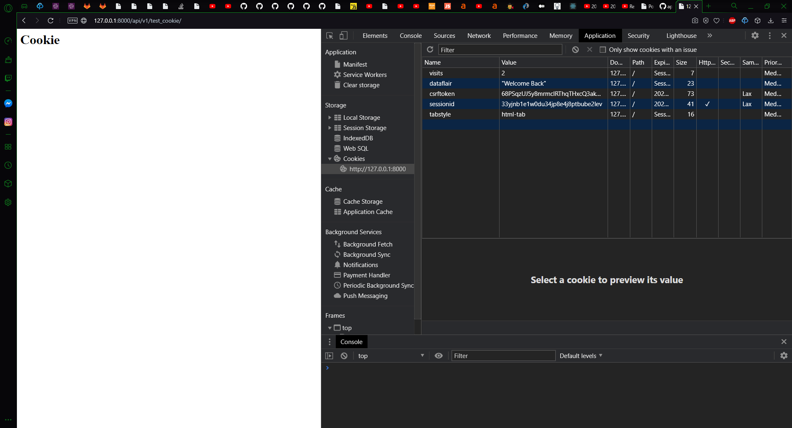

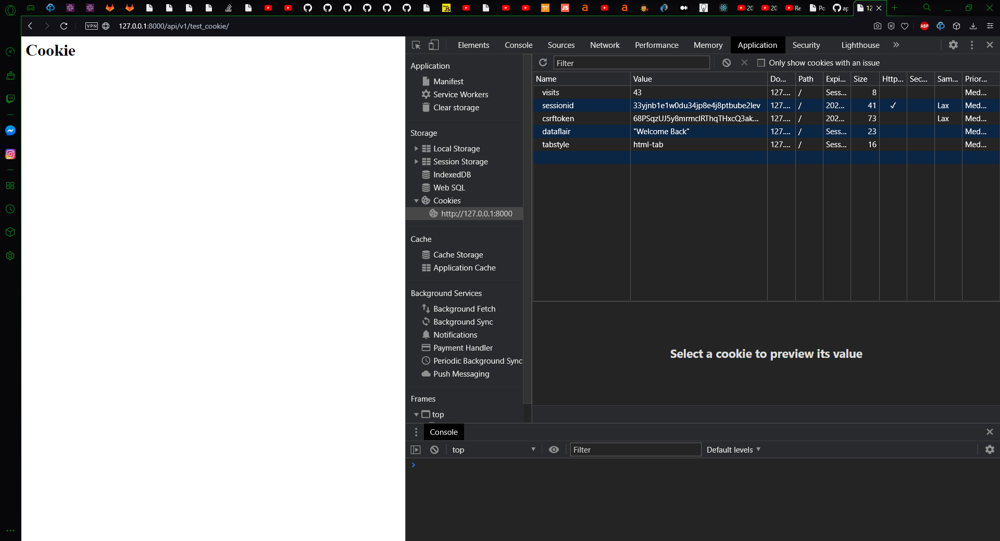

<h1>DRF api\v2</h1>
<h1>Viewsety</h1>
Do api/v2 zostały dodane view sety oraz routery .
Zamiast wcześniej stworzonych 2 viewsów KsiazkaList i KsiazkaDetail stworzyłem 1 viewset KsiazkaViewSet . 
W KsiazkaViewSet jeszcze jedną z zmian jest dodanie w permision_classes dodatkowego permision a dokładnie Is Authonticated , ponieważ wiesety nie odczytują z ustawień defaultpermission przez co nie zalogowany użytkownik mógł widzić posty .
Natomiast zamiast url patterns trzeba wykorzystać routery . Po zmianach jest znacznie mniej kodu. Co do wyglądu naszych podstron są one takie same jak przy wykorzystaniu wczesniejszych viewsów.

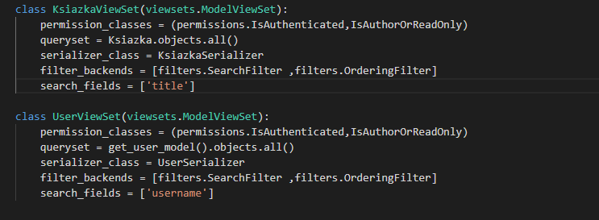

<h1>Router</h1>
Porzy pomocy SimpleRouter tworzymy nasz router . Następnie przy pomiocy metody regiter dodajemy nasze wcześniej stworzone viwesety oraz na konieć do zmiennej urlpatterns przypisujemy router.urls która tworzy za nas wszystkie urlpatterns.
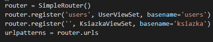

