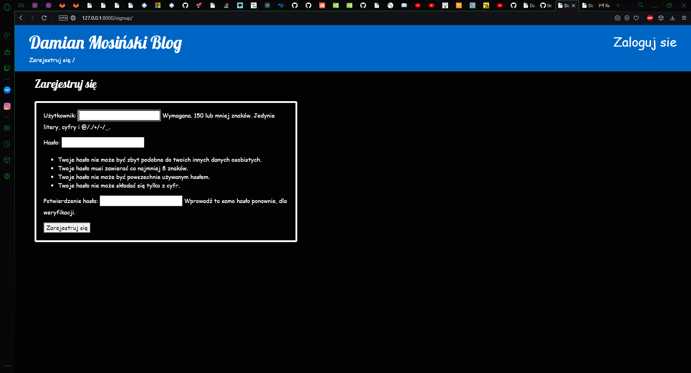

# Laboratorium 1 Python(Django+Heroku)
Na stronie starałem się zawrzeć wszystkie wymagania do lab1 i wydaję mi się że zostały spełnione , dodałem również przycisk usuwania obok edycji po kliknieciu w post .
 
Strona stworzona za pomocą poradnika :
https://tutorial.djangogirls.org/pl/django_forms/
 
Link do strony :
https://intense-harbor-53992.herokuapp.com
 
## Strona składa się z strony głównej z możliwością dodania postu(jedynie przez admina):

## Podstrony postu:

## I w podstronie postu 2 opcje usunięcie postu i edycja 

Po usunięciu postu.

## Admin

# Laboratorium 2 Python

## Strona bez zalogowania . Ograniczona dostępność do funkcji na stronie.

## Rejestracja dostępna dla wszystkich użytkowników .

## Logowanie .

## Po zalogowaniu możliwe wszystko co może admin na stronie .

## Zmiana hasła .

## Reset hasła.

<h1>Zmiana hasła na mailu .</h1>

